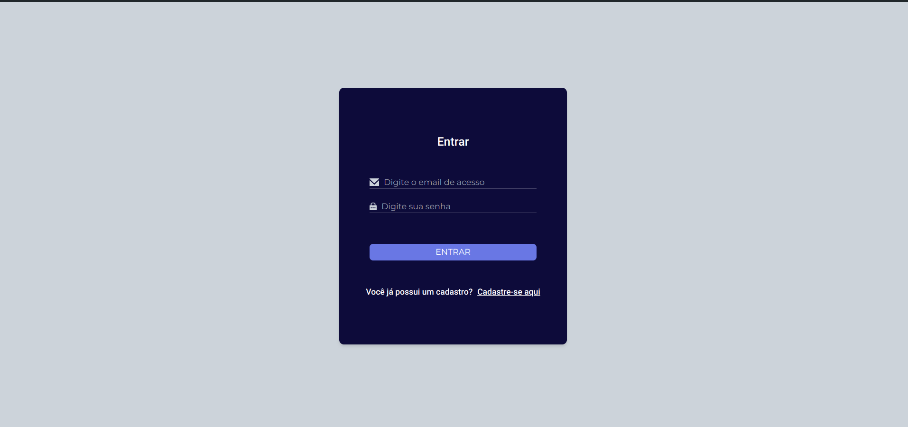
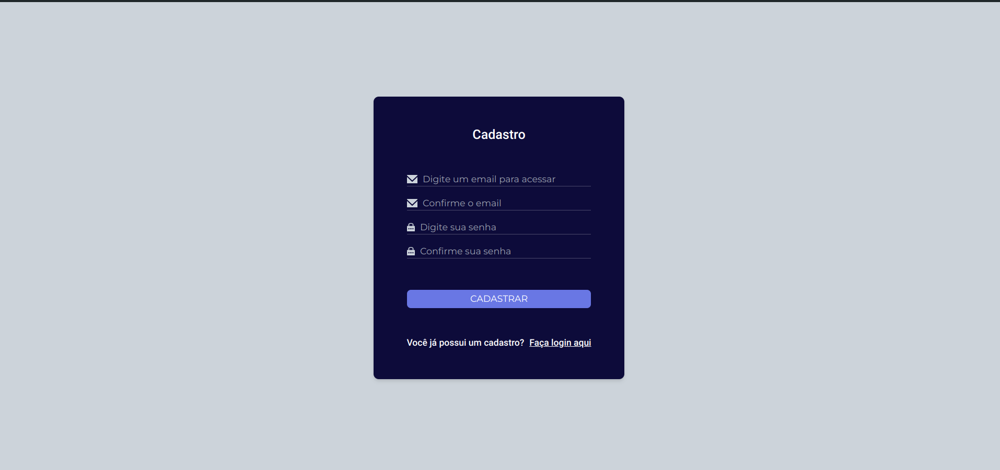
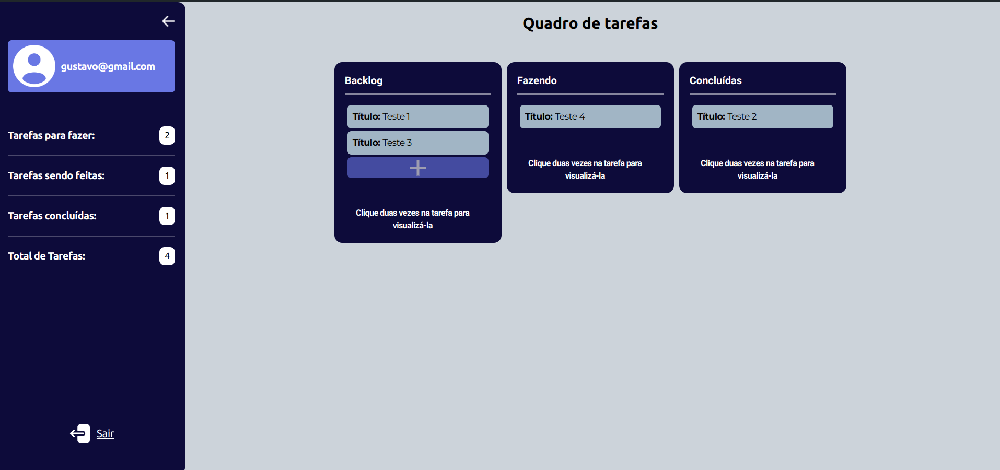
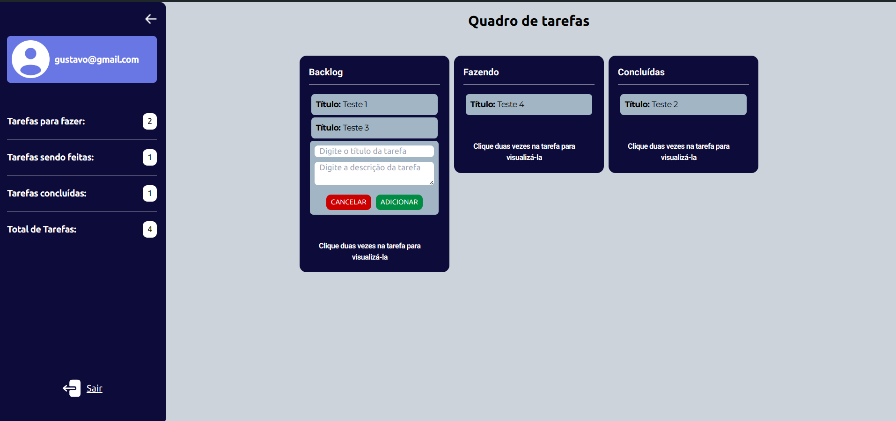
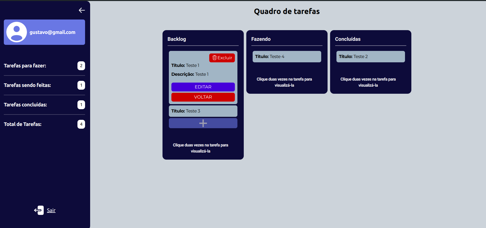

# Desafio lista de tarefas

O projeto lista de tarefas foi desenvolvido como solução para um desafio técnico de uma vaga de estágio full stack.

## Índice

- [Sobre](#sobre)
- [Instalação](#instalação)
- [Uso](#uso)
- [Testes](#testes)
- [Desenvolvimento](#desenvolvimento)
- [Imagens](#imagens)
- [Protótipo](#protótipo)
- [Deploy](#deploy)

## Sobre

O objetivo do projeto era criar uma lista de tarefas com funcionalidades completas de CRUD, além de implementar autenticação de usuários. Foram utilizadas diversas referências, como a estrutura de quadros do Trello, que inspirou a divisão de tarefas no sistema, proporcionando uma organização eficiente e intuitiva.

## Tecnologias utilizadas

- **React.js:** Framework React para desenvolvimento de aplicações web.
- **Outras tecnologias:** Back-end desenvolvido em Nodejs, utilizando a biblioteca express ([link para o repositório](https://github.com/EversonDoNascimento/Desafio_Jack_Experts))

## Instalação

Siga as instruções abaixo para configurar e executar o projeto localmente.

Antes de iniciar essa instalação, é recomendado que você já tenha acessado e seguido o tutorial de instalação do back end do projeto

- Requisitos:

  - Node instalado
  - Npm instalado

```bash

  # Comando para verificar se o node está instalado
  node --version
```

```bash

  # Comando para verificar se o npm está instalado
  npm --version

```

- Clone o projeto

```bash

# Clone o repositório via SSH
git clone git@github.com:EversonDoNascimento/Desafio_Jack_Experts_FRONT.git


# Clone o repositório via HTTPS
git clone https://github.com/EversonDoNascimento/Desafio_Jack_Experts_FRONT.git

```

- Entre no diretório do projeto

```bash

  cd Desafio_Jack_Experts_FRONT

```

- Crie o arquivo .env que irá conter a url da Api

```bash
# No linux você pode utilizar o comando nano

  nano .env

```

- Crie a variável VITE_API_URL

```bash
# Caso o seu back end esteja rodando na mesma porta (3333) basta copiar e colar:

  VITE_API_URL="http://localhost:3333/api"


```

Obs.: Não esqueça de apertar ctrl+o para salvar o alteração no arquivo .env, e ctrl+x para fechar.(Caso tenha optado por criar o arquivo através do nano).

- Dentro do diretório raiz do projeto, abra o terminal e cole o seguinte comando:

```bash
  npm i
```

- Para colocar o projeto para funcionar utilize o seguinte comando:

```bash
  npm run dev
```

## Uso

- Pronto! O projeto já deve estar disponível no link: http://localhost:5173/

## Testes

Os testes feitos no front-end foram teste unitários. Testei algumas funções específicas do sistema, principalmente as que tratavam de validações de dados.

- Execute o seguinte comando para rodar os testes

```bash
  npm run test
```

## Desenvolvimento

A interface do projeto e o gerenciamento de tarefas foram desenvolvidos com base em algumas referências mencionadas anteriormente. O objetivo principal foi criar uma aplicação simples, adequada para a funcionalidade de um gerenciador de tarefas, mas que também seguisse parte da dinâmica de sistemas maiores e já consolidados no mercado.

Na parte técnica, utilizei o Context API do React para reduzir a repetição de código e garantir a sincronização das alterações feitas nas tarefas em diferentes partes da aplicação que consomem o provider de tarefas. Também apliquei boas práticas de programação, como a criação de constantes e componentes reutilizáveis para elementos repetitivos.

A escolha do JWT como método de autenticação foi uma exigência do projeto. No entanto, optei por armazenar o JWT no localStorage por questões de praticidade, embora essa abordagem não seja recomendada para aplicações que demandam um nível de segurança mais elevado.

## Imagens







## Protótipo

Link do figma do projeto: [Clique aqui para acessar!](https://www.figma.com/design/5sAYCdu76J3erVMLNz6IVG/Desafio-Jack-Expert?t=1SRZbf3UyWD9AKid-0)

## Deploy

A API do projeto foi hospedada no Google Cloud. No entanto, como o certificado SSL é autoassinado, é necessário conceder as permissões apropriadas nos navegadores para acessá-la. Caso contrário, qualquer requisição feita pelo front-end à API poderá falhar, impedindo o funcionamento correto da aplicação.
Sendo assim, antes de acessar o site entre no seguinte link e conceda permissão no navegador:

[Link API](https://35.192.146.233/)

Logo após conceder a permissão para acessar o site, pode fechar a página padrão do nginx.

O Front-end do projeto foi hospedado na plataforma da Vercel.

[Link do site](https://desafio-jack-experts-fr-git-1d6f72-everson-nascimentos-projects.vercel.app)
